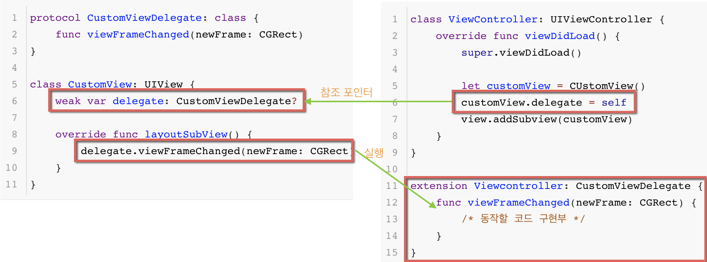

# Delegate

- 자신이 할 일을 다른 인스턴스에게 대신 처리하도록 구현하는 디자인 패턴을 말합니다.
- 요청하는 객체와 요청에 응답할 객체로 나누어 작성합니다.
- MVC 패턴에서는 View -> ViewController에게 말할 때 사용합니다.
  - 뷰가 받은 이벤트나 상태를 뷰 컨트롤러에게 전달하여 처리
  - 뷰 구성에 필요한 정보를 뷰 컨트롤러가 결정하도록 함
  - 주요 코드는 숨기고 가능한 특정 상황에 대해서만 커스터마이징 할 수 있도록 제공

<br>

<br>

- 델리게이트는 선언구와 구현부로 나누어 집니다.

<br>

## 선언부

- Protocol을 사용해서 델리게이트의 요구사항을 선언합니다.
- 선언하고자 하는 클래스에 delegate Property를 생성합니다.
  - 일반적으로 delegate라는 이름을 사용합니다.
  - 프로토콜 추상화 타입을 사용합니다.

```swift
protocol CustomViewDelegate: class {
    func viewFrameChanged(newFrame: CGRect)
}

class CustomView: UIView {
    weak var delegate: CustomViewDelegate?
    
    override func layoutSubView() {
        delegate.viewFrameChanged(newFrame: CGRect)
    }
}
```

<br>

<br>

## 구현부

- 선언해 놓은 곳에서의 이벤트나 상태, 정보가 변경될때와 같은 사용하겠다고 선언해준곳에 변경점이 발생할때마다 실제로 사용할 코드를 구현합니다.

<br>

```swift
class ViewController: UIViewController {
    override func viewDidLoad() {
        super.viewDidLoad()
        
        let customView = CUstomView()
        customView.delegate = self
        view.addSubview(customView)
    }        
}

extension Viewcontroller: CustomViewDelegate {
    func viewFrameChanged(newFrame: CGRect) {
        /* 동작할 코드 구현부 */
    }
}
```

<br>

<br>

## 구현 원리?

`프로토콜의 요구사항을 충족시키려면 프로토콜이 제시하는 청사진을 모두 구현해야 합니다.`

- 프로토콜로 해당 델리게이트의 요구사항을 선언했고 delegate 프로퍼티는 그 요구사항을 채택한 애들만 값을 넣을수 있습니다.
- 선언부에서는 delegate 프로퍼티에 어떤 참조포인터가 들어올지는 알수 없지만 같은 프로토콜을 따르고 있다면 해당 메서드를 구현해 놨을것이다라고 예상할수 있습니다.
- 구현부에서는 `customView.delegate = self` 를 통해서 참조 포인터를 delegate 프로퍼티에 넣게되고 이를 통해 customView가 이벤트나 상태변경과 같은 상황 발생시 호출을 할 것이라는 것을 예상할수 있습니다.
- 그렇기 때문에 메서드가 호출 되었을때 필요한 행동을 구현해 놓을수 있습니다.



